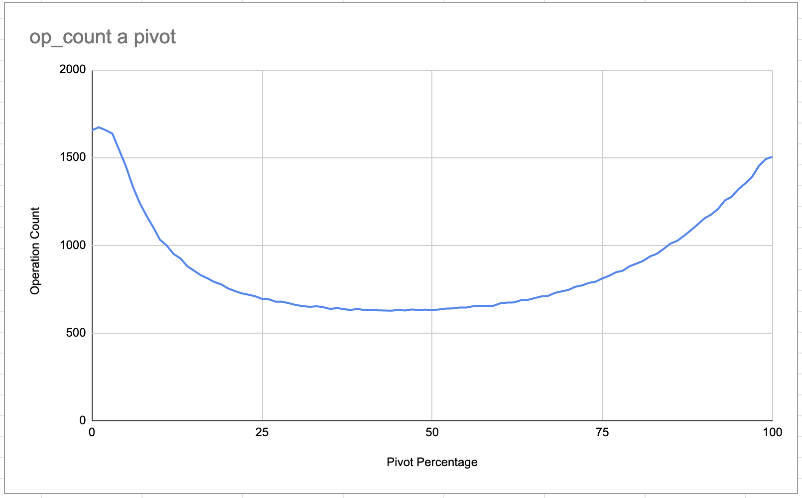

# push_swap

This is a [42 School](https://www.42lausanne.ch/) project. It is a console program (`push_swap`) written in C, sorting a set of
integers using two stacks and a set of instructions to move the numbers on and between the stacks.
The goal is to output a set of these instructions and keep their number as low as possible.

The bonus for this assignment is creating a second program (`checker`) that checks if a given set of instructions sorts a given set of numbers correctly.

For more details on the assignment, check `subject.pdf`.

I have also written a more advanced tool for testing and debugging, in Python (`tester.py`) which, besides having the same abilities as `checker` does, can also generate arbitrary amounts of tests. Its `argparse` interface includes all necessary details.

Example usage of the Python checker: `./tester.py --testamount 100 --numamount 5 --minnum 1 --maxnum 10 --errorabort`: 
performs 100 tests with random sets of 5 numbers, the numbers ranging from 1 to 10 and aborts if an error occurs, displaying
the erroring set.

---

Here are the instructions used for sorting:

- `sa` (swap a): Swap the first 2 elements at the top of stack a.
Do nothing if there is only one or no elements.
- `sb` (swap b): Swap the first 2 elements at the top of stack b.
Do nothing if there is only one or no elements.
- `ss` : sa and sb at the same time.
- `pa` (push a): Take the first element at the top of b and put it at the top of a.
Do nothing if b is empty.
- `pb` (push b): Take the first element at the top of a and put it at the top of b.
Do nothing if a is empty.
- `ra` (rotate a): Shift up all elements of stack a by 1.
The first element becomes the last one.
- `rb` (rotate b): Shift up all elements of stack b by 1.
The first element becomes the last one.
- `rr` : ra and rb at the same time.
- `rra` (reverse rotate a): Shift down all elements of stack a by 1.
The last element becomes the first one.
- `rrb` (reverse rotate b): Shift down all elements of stack b by 1.
The last element becomes the first one.
- `rrr` : rra and rrb at the same time.

How the amount of instructions affects the grade:
* Sorting 3 values: no more than 3 actions. 
* Sorting 5 values: no more than 12 actions.
* Sorting 100 values: rating from 1 to 5 points depending on the number of actions:
* 5 points for less than 700 actions
  * 4 points for less than 900
  * 3 points for less than 1100
  * 2 points for less than 1300
  * 1 point for less than 1500
* Sorting 500 values: rating from 1 to 5 points depending on the number of actions:
  * 5 points for less than 5500 actions
  * 4 points for less than 7000
  * 3 points for less than 8500
  * 2 points for less than 10000
  * 1 point for less than 11500

Validating the project requires at least 80/100 points (there are also points attributed for other things).

---

How does my solution work?

Similarly to certain algorithms (like quicksort), I first choose a pivot* and divide my initial stack
in half. I then proceed to move the upper half to the second stack. While doing so, I choose a second pivot -
if a number is bigger than the pivot, it stays on top, otherwise it's sent to the bottom. I repeat these steps
until my first stack is left with one element (the biggest), and the second stack looks like this:

Then, I look for the biggest element in the second stack and move it to the first stack. This is
repeated until there are no elements left on the second stack. The first stack is then sorted.

I also perform three major optimizations:
* Instructions are stored before being output and if any instructions can be contracted (for example `ra` + `rb` into `rr`), they are.
* While in the second phase, while moving elements back from the second to the first stack, if any elements happen to be in the right order prior to finding the largest numbers, they are immediately moved on the first stack. When the biggest element is also moved to the first stack, the amount of operations required to rearrange elements is lesser than if only the biggest element had been moved.
* If I don't get a number of instructions lower than desired, I set the pivot to a lower value and retry, incrementing until a limit or the amount of instructions is acceptable.

*How are the pivots determined? At first it was the median. Then I saw that changing the pivot can 
lower or add to the amount of instructions. I first used a Python script to determine the best first pivot, while
keeping the second at the median. With this result I looked for an optimal value of the second pivot.
Changing then the first pivot, only resulted in worse results, so I did not bother testing all possible combinations
of pivots.

Below is a graph with the results of the first test. The script executed hundred tests for each pivot value and kept the average number
of instructions. The amount of numbers to sort was also hundred. The optimal percentage at which the pivot should
separate the first stack, for hundred numbers, was at that time (the algorithm was a bit different) 44%.

